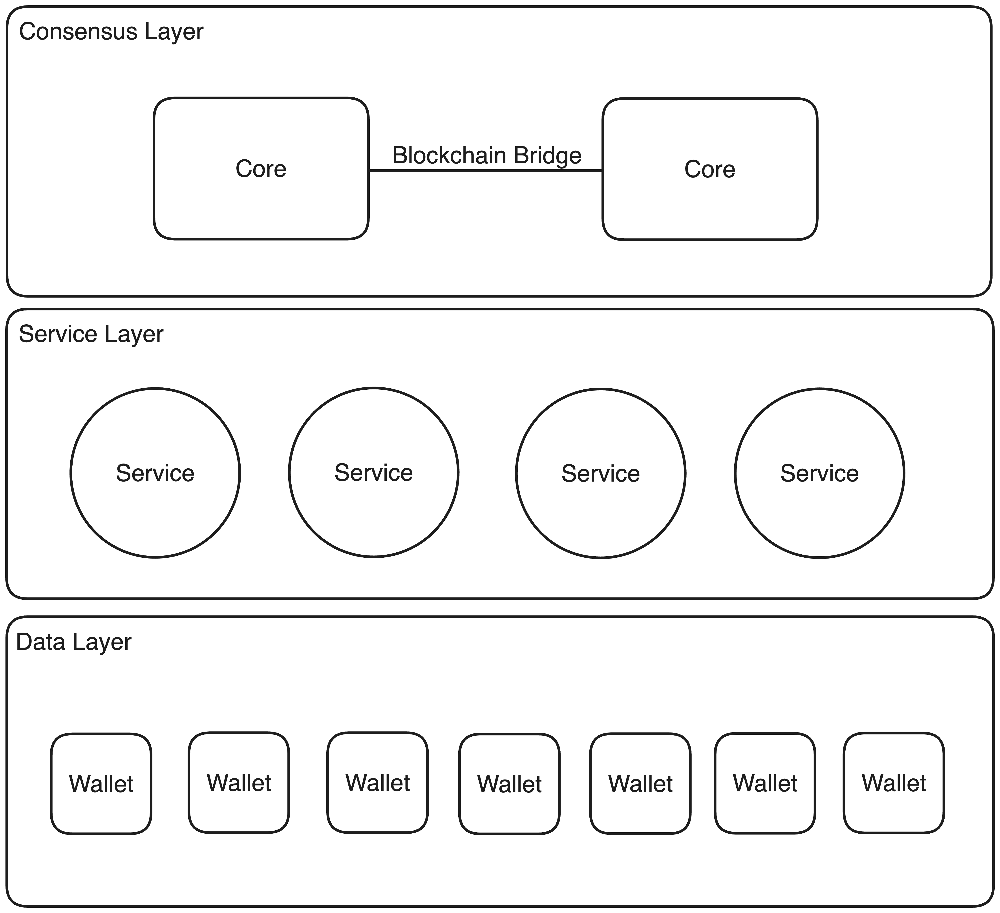

<!--
_class: lead
_paginate: false
-->

# 基於 OurChain 的自主身分系統設計與實作

林俊佑
指導教授：薛智文 博士

國立臺灣大學 資訊工程研究所

---

# 目錄

1. 研究背景與目的
2. 文獻探討
3. 系統設計
4. 系統實作
5. 結論與未來展望

---

# 1. 研究背景與目的

---

## 當前數位身分管理的挑戰

- **隱私安全問題**

  - 個人資料被大型科技公司和政府機構掌控
  - 網路行為被記錄和分析，常常未經充分同意

- **使用者權益受限**
  - 對個人數據缺乏控制權
  - 數據被不當利用的風險

---

## 自主身分(AID)系統概念

- 讓每位使用者在具備道德標準的身分系統中自由管理自己
- 重塑數位身分管理的權力結構
- 將主權從壟斷者手中歸還給使用者

---

## 研究目標

1. 解決現有系統局限性
2. 構建 AID 理論框架
3. 設計技術架構
4. 評估優劣勢
5. 驗證系統可行性

---

# 2. 文獻探討

---

## 身分系統的演進

---

## 身分系統的演進(續)

---

## 身分系統的演進(續)

---

## 身分系統的演進(續)

---

## 身分系統的演進(續)

---

## 現有身分系統的困境

1. **使用者體驗**

   - 安全性與便利性的權衡
   - 無摩擦驗證的需求

2. **使用者認知**
   - 管理多個身分的困難
   - 安全意識與實際行為的差距

---

## 現有身分系統的困境（續）

3. **隱私保護**

   - GDPR 等法規的遵循挑戰
   - 積極授權和被遺忘權的實現

4. **平等信任**
   - 使用者與系統供應者之間的利益衝突
   - 去中心化系統中的身分驗證問題

---

## 身分系統評估標準

1. **創新突破**

   - 解決現有困境
   - 提供無摩擦驗證
   - 簡化身分管理

2. **法規遵循**

   - 符合 GDPR 等隱私法規
   - 遵守 NIST 等技術標準

3. **公認原則**
   - 符合身分法則
   - 避免常見缺陷
   - 遵循自治身分原則

---

# 3. 系統設計

---

## 核心機制

1. **道德標準的建立**

   - 基於區塊鏈的去中心化評價機制
   - 多數使用者形成共識，制衡少數強勢參與者

2. **自由管理自己**
   - 數據管理：使用者完全控制個人數據
   - 功能管理：使用者自主決定行使哪些功能

---

## 系統架構

---

## 關鍵技術

1. **自主憑證**

   - 使用者自行生成和管理
   - 基於區塊鏈技術實現身分驗證

2. **數據憑證**

   - 解決跨服務數據共享問題
   - 確保數據一致性和可信度

3. **去中心化評價機制**
   - 參與者互相評價
   - 形成公開透明的信任體系

---

## 資安與隱私考量

1. **身分識別**

   - 基於使用者時空的分析方法
   - 基於危險程度的驗證機制

2. **密碼救援**

   - 極限多因素驗證

3. **被遺忘權**

   - 區塊鏈僅保留雜湊，不保留數據本身

4. **積極數據授權**
   - 明確定義數據內容與授權範圍

---

# 4. 系統實作

---

## 概念驗證(PoC)架構

---

## 實現細節

1. **共識層**

   - 使用 OurChain 區塊鏈
   - 實現智能合約介面

2. **服務層**

   - AI 聊天服務
   - 支付服務
   - 自主憑證服務

3. **使用者層**
   - 基於 Flutter 開發跨平台應用
   - 使用 Hive 進行本地數據存儲
   - 使用作業系統的檔案系統完成數據遷移

---

## 流程分析：產生新 AID 與自主憑證

---

## 流程分析：進入支付服務獲取收據

---

## 流程分析：使用 AI 服務對話

---

# 5. 結論與未來展望

---

## 主要貢獻

1. 提出完整的自主身分(AID)系統概念
2. 設計自主的身分管理機制
3. 實現高度的安全性和隱私保護
4. 優化使用者體驗
5. 確保法規遵循
6. 通過概念驗證展示系統可行性

---

## 面臨的挑戰

1. **推廣任務**

   - 克服使用者習慣
   - 應對技術標準和法律法規的障礙

2. **開發難度**

   - 新技術的應用（如自主簽章）
   - 新概念的實現（如反轉數據層）

3. **大規模應用**
   - 擴展到更廣泛的領域
   - 探討大規模部署的可行性

---

## 未來研究方向

1. **跨領域應用**

   - 金融：跨機構身分驗證、信用評估
   - 醫療：患者控制的電子病歷系統
   - 政務：電子身分證、電子投票系統

2. **與現有系統融合**

   - 探索與傳統身分系統的相容性
   - 設計過渡策略

3. **性能與安全性優化**
   - 提高系統處理能力
   - 強化安全機制

---

# 總結

- 自主身分系統代表了數位身分管理的未來
- 通過創新設計解決了現有系統的主要問題
- 面臨推廣和大規模應用的挑戰
- 有望在多個領域帶來革命性變革

---

<!--
_class: lead
_paginate: false
-->

# 謝謝聆聽

歡迎提問
